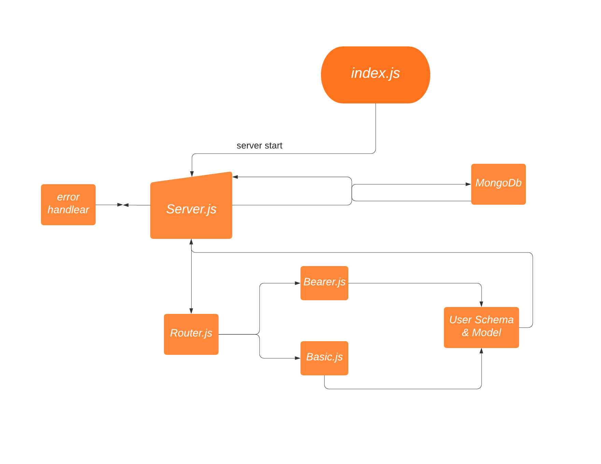

# bearer-auth

## Author: Alaa Abu Issa

## Requirement 
we will be building an Auth Api server using best practices, including server modularization, use of middleware, and tests.

## UML 

## LINKS :

Heroku URL : https://alaa-bearer-auth.herokuapp.com/

Github Actions : https://github.com/Alaa-AbuIssa/bearer-auth/actions

Pull Request: https://github.com/Alaa-AbuIssa/bearer-auth/pull/1
